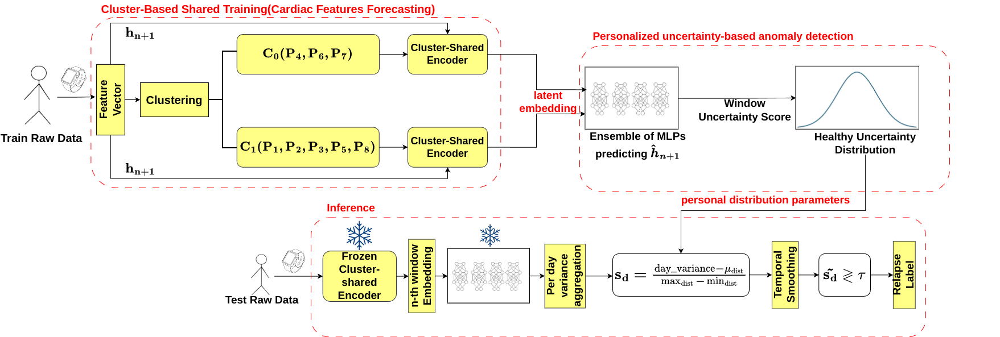

# Beyond Personalization: Cluster-Aware Shared Learning for Wearable-Based Psychotic Relapse Detection

[](https://www.python.org/downloads/)
[](https://pytorch.org/)
[](LICENSE)


## Overview

Digital phenotyping via passive wearable monitoring offers a promising path toward continuous, unobtrusive psychotic relapse prediction. Existing approaches face a fundamental **heterogeneity–generalizability tradeoff**: global models fail to capture idiosyncratic patient patterns, while purely personalized schemes cannot exploit shared physiological structure and are constrained by per-patient data scarcity.

We propose a **cluster-aware shared representation learning framework** as a principled intermediate that:

- Groups patients via hierarchical agglomerative clustering (Ward linkage) on heart rate variability and activity features, recovering a partition that aligns with clinical diagnosis without label supervision
- Trains a cluster-level Transformer encoder under **inverse-frequency sample weighting** to ensure equal gradient contribution across patients regardless of recording duration
- Feeds personalized **MLP ensemble heads** modeling each patient's healthy uncertainty distribution
- Applies **temporal smoothing** of daily anomaly scores to reflect the progressive nature of psychotic relapse rather than treating it as an isolated daily event

Our method outperforms fully personalized, fully global, and prior SoTA approaches across AUROC, AUPRC, and their mean simultaneously on the e-Prevention cohort.

<p align="center">
  
</p>

---

## Repository Structure

```
├── model.py              # TransformerHeartPredictor + EnsembleLinear
├── dataset.py            # PatientDataset and ClusterDataset (with inverse-frequency weights)
├── trainer.py            # Two-stage ClusterTrainer (shared encoder + personal heads)
├── train.py              # Training entry point
├── test.py               # Inference + temporal aggregation + metric computation
├── cluster_utils.py      # Ward-linkage clustering, t-SNE and PCA visualisations
├── requirements.txt
└── data/
    ├── track_2/                      # Challenge split folders with relapses.csv
    └── track_2_new_features/         # Pre-extracted feature CSVs (provided)
```

---

## Data

Raw biosignals are not redistributed. This repository provides **pre-extracted feature CSVs** derived from the e-Prevention Grand Challenge dataset (ICASSP 2024, Track 2). The raw smartwatch recordings can be requested from the official challenge:

> [e-Prevention Signal Processing Grand Challenge — ICASSP 2024](https://e-prevention.github.io/challenge.html)

The provided `data/` directory follows this structure:

```
data/
├── track_2/
│   └── P1/ ... P8/
│       └── {train,val,test}_<episode>/
│           └── relapses.csv
└── track_2_new_features/
    └── P1/ ... P8/
        └── train_<episode>/
        │   └── features_stretched_w_steps.csv
        ├── val_<episode>/
        │   ├── features_stretched_w_steps.csv
        │   └── relapse_stretched.csv
        └── test_<episode>/
            ├── features_stretched_w_steps.csv
            └── relapse_stretched.csv
```

Each `features_stretched_w_steps.csv` contains 5-minute epoch summaries of 8 physiological and activity features: `acc_norm`, `gyr_norm`, `heartRate_mean`, `rRInterval_mean`, `rRInterval_rmssd`, `rRInterval_sdnn`, `rRInterval_lombscargle_power_high`, `steps`.

---

## Installation

**1. Clone the repository**

```bash
git clone git@github.com:nikostsalkitzis/Cluster-aware-psychotic-relapse-prediction.git
cd Cluster-aware-psychotic-relapse-prediction
```

**2. Create a virtual environment (recommended)**

```bash
python -m venv venv
source venv/bin/activate        # Linux / macOS
venv\Scripts\activate           # Windows
```

**3. Install PyTorch**

Install PyTorch matching your CUDA version from [pytorch.org](https://pytorch.org/get-started/locally/). Examples:

```bash
# CUDA 12.1
pip install torch --index-url https://download.pytorch.org/whl/cu121

# CPU only
pip install torch --index-url https://download.pytorch.org/whl/cpu
```

**4. Install remaining dependencies**

```bash
pip install -r requirements.txt
```

---

## Usage

### Step 1 — Train

Trains the cluster-shared Transformer encoder and all personal ensemble heads. Clustering is performed automatically on the first run and cached under `--save_path`.

```bash
python train.py \
    --features_path data/track_2_new_features/ \
    --dataset_path  data/track_2/ \
    --save_path     checkpoints_clustered \
    --n_clusters    2 \
    --epochs        50 \
    --batch_size    16 \
    --learning_rate 1e-3 \
    --head_learning_rate 3e-4
```

Cluster assignments and per-cluster scalers are saved to `checkpoints_clustered/`. The best checkpoint per patient (selected by maximum mean AUROC+AUPRC on the validation split) is saved as:

```
checkpoints_clustered/
└── <patient_id>/
    ├── best_encoder.pth
    ├── best_ensembles.pth
    ├── scaler.pkl
    └── train_dist_anomaly_scores.pkl
```

### Step 2 — Inspect Clustering (optional)

Clustering plots (PCA overview and the diagnosis-coloured t-SNE matching Figure 3 of the paper) are generated automatically during training and saved to `checkpoints_clustered/`:

```
checkpoints_clustered/
├── patient_cluster_plot.png       # PCA + t-SNE coloured by cluster
└── patient_tsne_diagnosis.png     # t-SNE coloured by clinical diagnosis (Figure 3)
```

To run clustering standalone without training:

```bash
python cluster_utils.py \
    --features_path data/track_2_new_features/ \
    --n_clusters    2 \
    --save_path     checkpoints_clustered
```

### Step 3 — Evaluate

**Validation split** (hyperparameter selection — lookbacks and thresholds):

```bash
python test.py \
    --features_path data/track_2_new_features/ \
    --dataset_path  data/track_2/ \
    --load_path     checkpoints_clustered/ \
    --mode          val \
    --agg_mode      A \
    --lookbacks     4 4 4 4 4 4 4 4
```

**Test split** (final evaluation — Table I of the paper):

```bash
python test.py \
    --features_path data/track_2_new_features/ \
    --dataset_path  data/track_2/ \
    --load_path     checkpoints_clustered/ \
    --mode          test \
    --agg_mode      A \
    --thresholds -0.1 -0.1 -0.1 -0.1 0 0 0 -0.1 \
    --lookbacks 2 12 12 2 12 3 12 12 \
```

#### Temporal Aggregation Modes

| Mode | Description |
|------|-------------|
| `A` | Rolling mean of raw anomaly scores (default) |
| `B` | Rolling mean of binary flags (majority-vote style) |
| `C` | Recency-weighted mean (exponential decay, recent days weighted more) |
| `D` | Rolling max (high recall, sensitive to any elevated day) |

#### Per-Patient Hyperparameters

`--lookbacks` and `--thresholds` each accept exactly `--num_patients` values (one per patient, ordered P1 … P8). These are selected on the validation split by maximising mean AUROC+AUPRC.

```bash
python test.py \
    --features_path data/track_2_new_features/ \
    --dataset_path  data/track_2/ \
    --load_path     checkpoints_clustered/ \
    --mode          test \
    --agg_mode      A \
    --lookbacks     4 7 4 4 7 4 7 4 \
    --thresholds    0.0 0.1 -0.05 0.2 0.0 0.15 -0.1 0.3
```

---

## Reproducing Table I

Table I reports **mean ± std over 15 independent runs**. Due to stochastic weight initialisation, ensemble resampling, and DataLoader shuffling, individual runs will produce results within the reported variance range rather than exactly matching the table means. To reproduce the reported statistics, run training 15 times and average AUROC, AUPRC, and their mean across runs:

```bash
for i in $(seq 1 15); do
    python train.py \
        --save_path checkpoints_run_$i \
        --features_path data/track_2_new_features/ \
        --dataset_path  data/track_2/

    python test.py \
        --load_path     checkpoints_run_$i \
        --features_path data/track_2_new_features/ \
        --dataset_path  data/track_2/ \
        --mode          test \
        --thresholds -0.1 -0.1 -0.1 -0.1 0 0 0 -0.1 \
        --lookbacks 2 12 12 2 12 3 12 12 \

done
```

---

## Method Summary

The pipeline consists of three stages that together resolve the heterogeneity–generalizability tradeoff:

**1. Patient clustering.** Each patient is represented by a compact median physiological profile over their training data, standardised via z-score normalisation. Hierarchical agglomerative clustering with Ward linkage groups physiologically similar patients, yielding a partition that aligns with clinical diagnosis (Bipolar I Disorder vs. Schizophrenia Spectrum) without any label supervision.

**2. Cluster-shared encoder training.** A Transformer encoder is trained per cluster to forecast the five cardiac features at the next timestep. Inverse-frequency sample weighting ensures equal total gradient mass per patient regardless of recording duration, preventing majority-relapse patients from dominating the shared latent space.

**3. Personalized anomaly detection with temporal smoothing.** The frozen encoder feeds a personalized ensemble of MLPs per patient. Ensemble variance serves as a window-level uncertainty score, normalized against each patient's healthy training distribution. Raw daily scores are smoothed over a patient-specific temporal horizon before thresholding, suppressing transient false positives while preserving sustained physiological deviations characteristic of genuine clinical deterioration.

---

## Results

Overall performance on the e-Prevention cohort (mean ± std, 15 runs):

| Method | AUROC | AUPRC | AVG |
|--------|-------|-------|-----|
| Fully Global | 0.510 ± 0.096 | 0.547 ± 0.163 | 0.529 ± 0.116 |
| Fully Personalized | 0.517 ± 0.043 | 0.635 ± 0.090 | 0.576 ± 0.048 |
| Current SoTA | 0.503 ± 0.016 | 0.664 ± 0.089 | 0.584 ± 0.047 |
| **Proposed (ours)** | **0.565 ± 0.090** | **0.669 ± 0.073** | **0.617 ± 0.061** |

---

## Citation

If you use this code or the pre-extracted features in your research, please cite:

```bibtex
@inproceedings{tsalkitzis2026beyond,
  title     = {Beyond Personalization: Cluster-Aware Shared Learning for
               Wearable-Based Psychotic Relapse Detection},
  author    = {Tsalkitzis, N. and Maragos, P. and Efthymiou, N.},
  booktitle = {Proceedings of the IEEE-EMBS International Conference on
               Body Sensor Networks (BSN)},
  year      = {2026}
}
```

---

## Acknowledgements

This work uses data from the e-Prevention project and the ICASSP 2024 e-Prevention Signal Processing Grand Challenge (Track 2). We thank the challenge organizers for making the dataset available to the research community.

---

## License

This project is licensed under the MIT License. See [LICENSE](LICENSE) for details.
